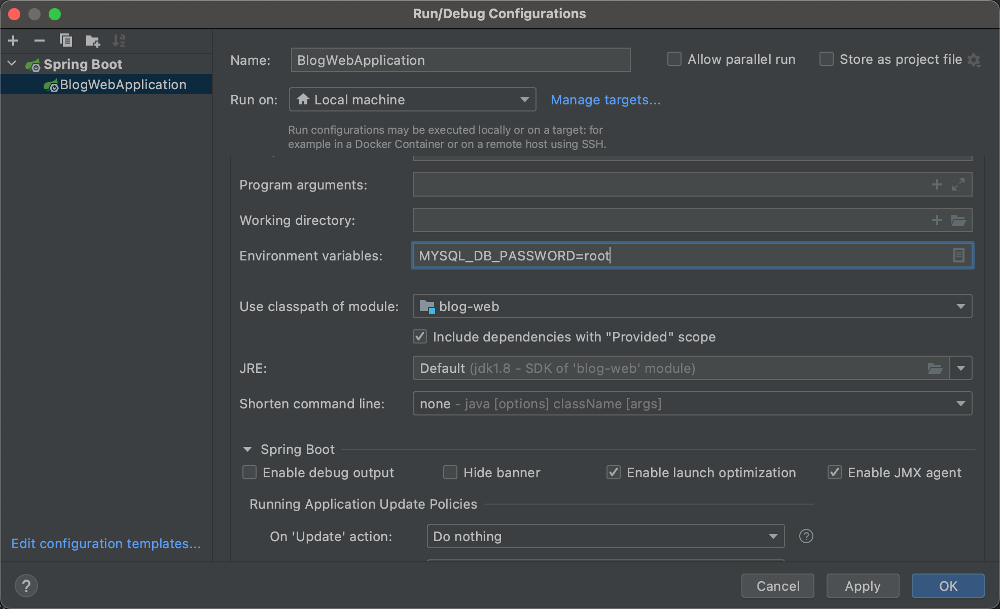

# spring-tutorials

>   Put some spring tutorials here.

### Play with GitHub codespaces

See [play-with-codespaces](./play-with-codespaces.md) .

Ref: [GitHub Codespaces overview](https://docs.github.com/en/codespaces/overview) .

### 1. Preparations

- Have learned some basic knowledge about Java
- Familiar with JetBrains IDEs, install its [IntelliJ IDEA](https://www.jetbrains.com/idea/)
- Have a good PC with Windows/Linux OS, or you have a MacBook(Air/Pro) or other Apple desktop device
- Install [Maven](https://maven.apache.org/download.cgi), or use [Gradle](https://gradle.org/) instead
- JDKs: please install newest 1.8 and 11-up versions, you can download some open-source JDKs by IntelliJ IDEA quickly
- Install [Git](https://git-scm.com/) and using it
- Missing something? ...

### 2. Development environments

Setting your local development environments: modified bash/fish/zsh etc shell config file when using Linux or macOS; if you're using Windows, modify your settings from `MyComputer/ThisComputer` environment properties.

>   If you are debugging in IDEA, you can modify environment variables from menu by click `RUN - Edit Configurations` submenu item.



```bash
# configurations for local environments 
# values in example are as default
export MYSQL_DB_HOST=localhost MYSQL_DB_PORT=3306 MYSQL_DB_USER=root MYSQL_DB_PASSWORD=root
export REDIS_HOST=localhost REDIS_PORT=2379 REDIS_PASSWORD=
export RABBITMQ_HOST=127.0.0.1 RABBITMQ_PORT=5672 RABBITMQ_USER=guest RABBITMQ_PASSWORD=guest
```

### 3. Enjoy
 
Clone this project and open it in IntelliJ IDEA. Then play with it by coding, debugging or running...

### INDEX

- [blog-web](blog-web/): a simple blog restful-api service with `mysql/redis/cache/swagger/...` supports.
- [sample-task](sample-task/): using spring scheduling to handle some task and job.
- [sample-messaging-rabbit](sample-messaging-rabbit/): sample code for message queue by using `RabbitMQ` .