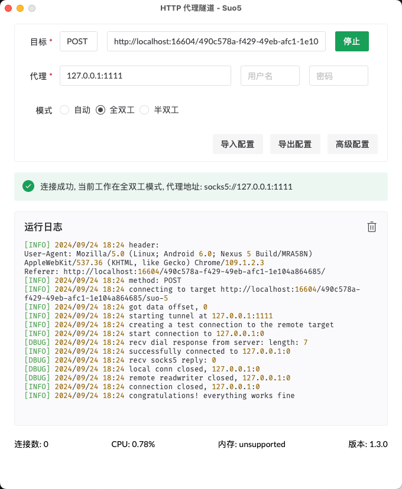

hacker-suo5
-----------

### Usage


```bash
cd hacker-suo5
mvn clean package
# run hacker-suo5 server in local
java -jar target/hacker-suo5-0.0.1-SNAPSHOT.jar
```
then open [suo5 gui](https://github.com/zema1/suo5/releases), operating as screenshot below:



and testing by curl using that sock5 proxy.

```bash
# socks5 with user and password seems not working, just leave blank
curl -x 'socks5://127.0.0.1:1111' https://www.bing.com
```